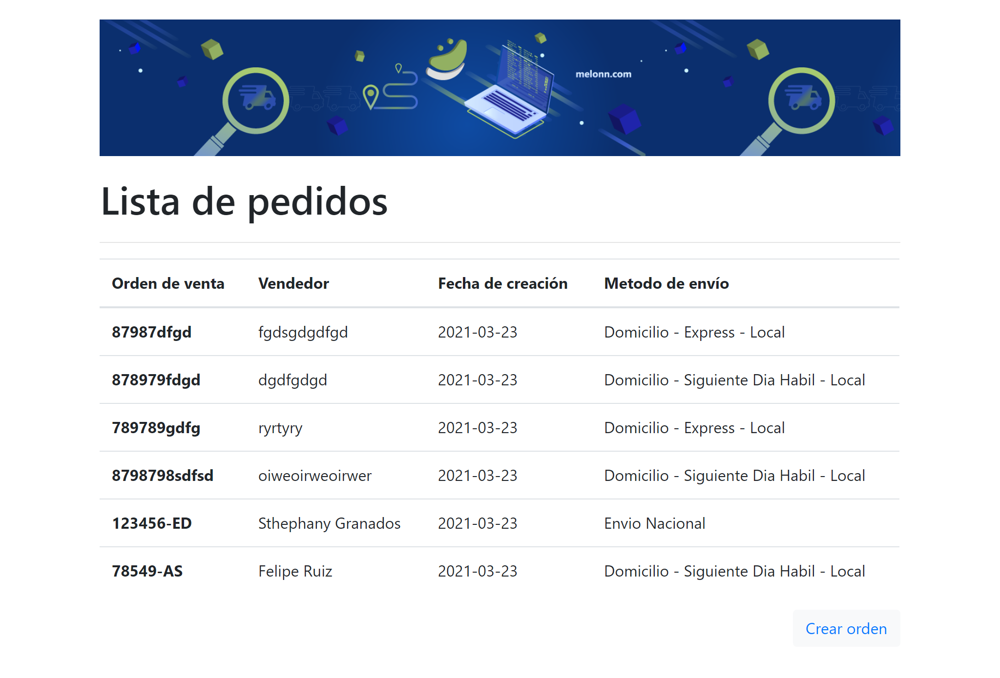
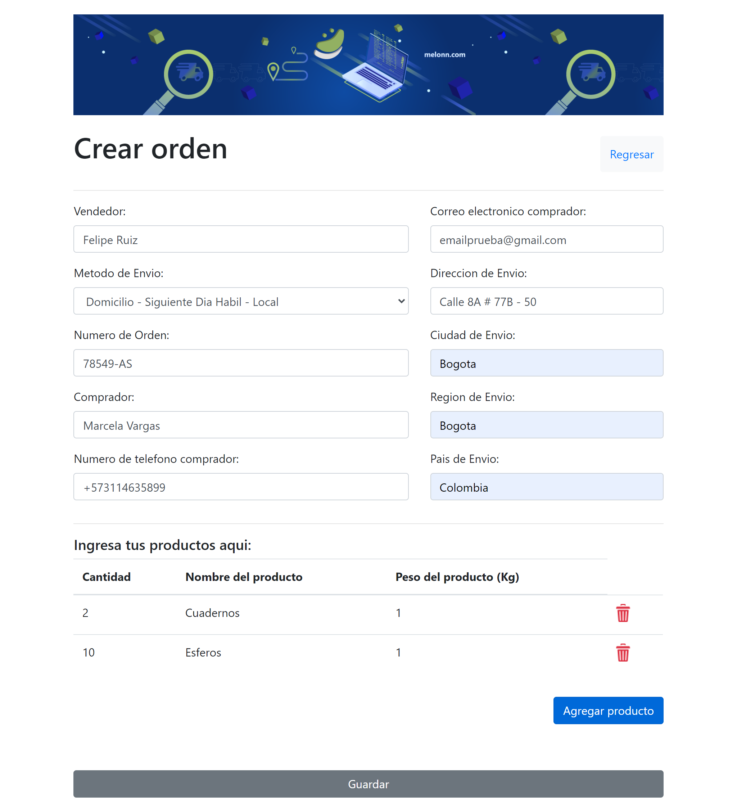
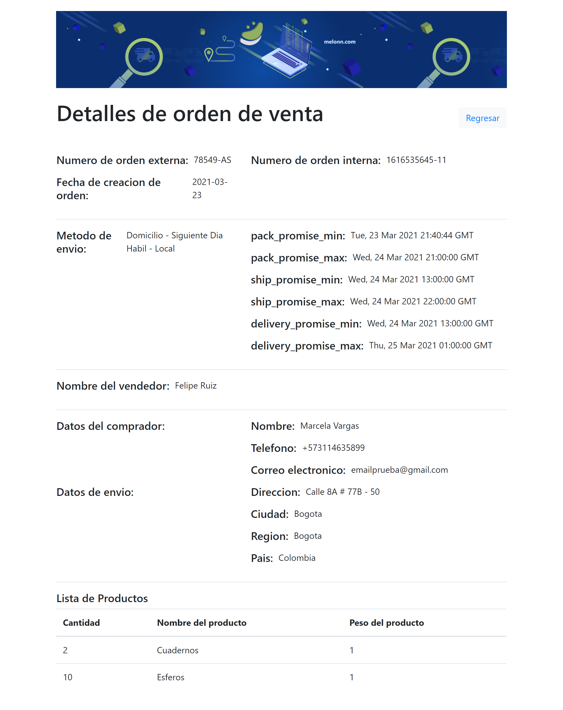

# Gestion de ordenes de compra

## 1. Contexto

Melonn ofrece una solución integral de cumplimiento de comercio electrónico para minoristas, desde el almacenamiento hasta la entrega con una plataforma tecnológica para orquestar y monitorear todo el proceso, lo que permite a cualquier minorista en LatAm ofrecer sin problemas entregas en el mismo día o al día siguiente 'como Amazon Prime' a los clientes finales. .

Los clientes de Melonn, a los que llamaremos *vendedores*, deben poder realizar un pedido en la plataforma de Melonn una vez que sus clientes realizan una compra, por lo tanto, necesitamos desarrollar un sistema de gestión de pedidos, un sistema en el que todos los pedidos son primero, creados y preparados para ser cumplidos.

## 2. Desarrollo del Frontend

Se utilizo la libreria de React.js para el desarrollo del proyecto, así como bootstrap, entre otros paquetes.

En el frontend contamos con 3 páginas:
 - Lista de pedidos de venta.
 
 - Creación de pedidos de venta.
  
 - Detalle de la orden de venta.
 

## 3. Desarrollo del Backend

Se creo un servidor en Express.js con almacenamiento temporal volatil.

### 3.1 API endpoints

El backend se ejecuta localmente en un puerto diferente (`3001`) que el `react-scripts` servidor de desarrollo (`3000`).

- #### **GET** `/api/getorders`.
_Traer todas las ordenes._
- #### **GET** `/api/detailsorder/:id`.
_Traer una orden por medio del id._
- #### **GET** `/api/method`.
_Traer los metodos de envío._
- #### **POST** `/api/create`.
_Crear una nueva orden._

## 4. Ejecutar el proyecto en local

Clone el proyecto con `git clone`.

Asegúrese de tener `node` y `npm`(o `yarn`) instalado en su máquina, luego ejecute:

```bash
$ npm install
$ npm start
```

Para `yarn`:

```bash
$ yarn
$ yarn start
```


